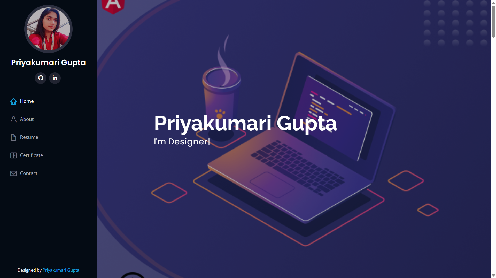
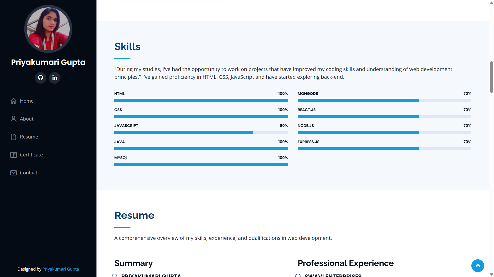
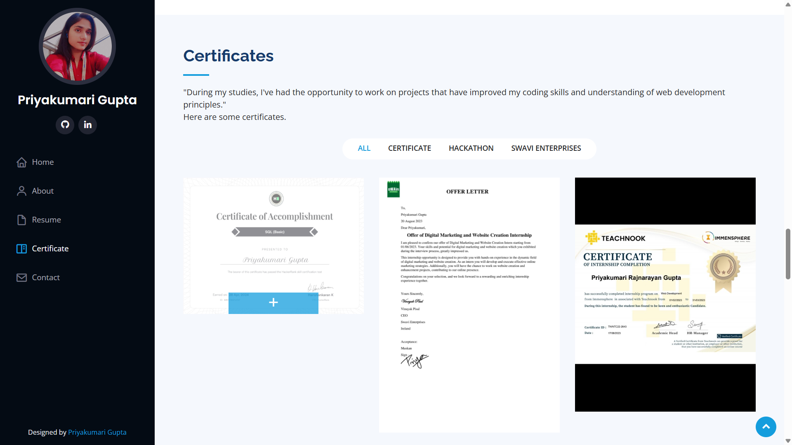

# 💻 Priyakumari Gupta's Portfolio

Welcome to my personal web development portfolio! This site showcases my skills, experience, and projects in front-end and back-end development. Built with a clean and responsive design, the portfolio reflects my passion for web technologies and professional growth.

🌐 **Live Demo:** [portfolioOfPriya.wuaze.com](http://portfolioOfPriya.wuaze.com)

---

## 📌 Features

- ✨ Responsive design using HTML5, CSS3, Bootstrap
- ⚙️ Interactive elements with JavaScript
- 🌐 Backend integration using PHP and MySQL (Contact Form)
- 📬 Functional contact form with validation and email/message storage
- 🏆 Hackathon & Internship experience
- 📚 Projects section with real examples

---

## 🚀 Technologies Used

- **Frontend:** HTML, CSS, JavaScript, Bootstrap
- **Backend:** PHP
- **Database:** MySQL
- **Hosting:** [InfinityFree](https://www.infinityfree.net)

---

## 🖼️ Screenshots

 

